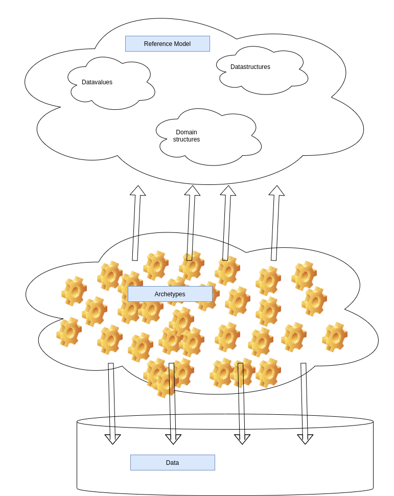

# Semantic Database

##[Semantics](https://en.wikipedia.org/wiki/Semantics)
Semantic data stand for data is referencing to meaning and context: the color red has a complete other meaning in another context. For example, there is a political color red, there is alizarin red, an oil-paint pigment/color, red states in the US are republican dominated states, but red countries are communist countries. Redskin is disrespectful slang for native Americans, while red skin can indicate seborrheic dermatitis.
On a banc-account, red stands for depts and in romantic communication red stands for warmth and love.
There is a lot to say about semantics, I just wanted to give examples of its importance

Data should be stored in context semantic explanation, only in this way can be searched and can be found.

The design principles should be simple, the possibilities to use it should be endless

I'm building a simple infrastructure that I call "semantic database". For now it is a hobby project, just for fun.

#### OpenEhr

OpenEhr is an semantic database design with a single Reference Model for a single but large purpose (healthcare). The semantic-database-concept is a widening of the OpenEhr idea. It is making semantic-storage possible for many domains, in fact, all domains.

## Overview

quick and dirty drawing ;-)

#### The Reference Model

This contains classes needed to be the base of archetypes or being used in archetypes.
We will always need datavalues like text, number, quantity, date-time and data-structures like list or set or table
Besides these we can choose to have domain-classes, these are the base of archetypes, but these can also be omitted and data-structures being used instead.

OpenEhr has a few domain-classes in their reference model, they decided that healthcare semantics needs a few fixed base-classes, for example Observation, Activity, Evaluation, Instruction.
There is nothing wrong with that but it narrows the interoperability to other ideas. One of the goals of the semantic database is to support constructs like OpenEhr.
But it will also support the EN13606 Reference Model which also has domain-classes but other, and FHIR which has HL7 related.

So many ways, in healthcare only.

But the semantic database will also support, for example, taxonomy in different disciplines, natural sciences, business and economics, computing, military, research taxonomy
It will support creating a database for a small business, a grocery or a hardware-store, accounting-software, hotel.

Many purposes, if not all thinkable purposes, even in one database, distributed.

All data are, if done right, self-explanatory, no dark relation-ships of which the meaning gets lost when the modeler finds a new job

#### The archetypes
Next time

## [The Reference Model](https://github.com/bertverhees/semanticdatabase-rm)

## The Archetype Model

## The Archetype-based Query Tool

## The Archetype-based Database
